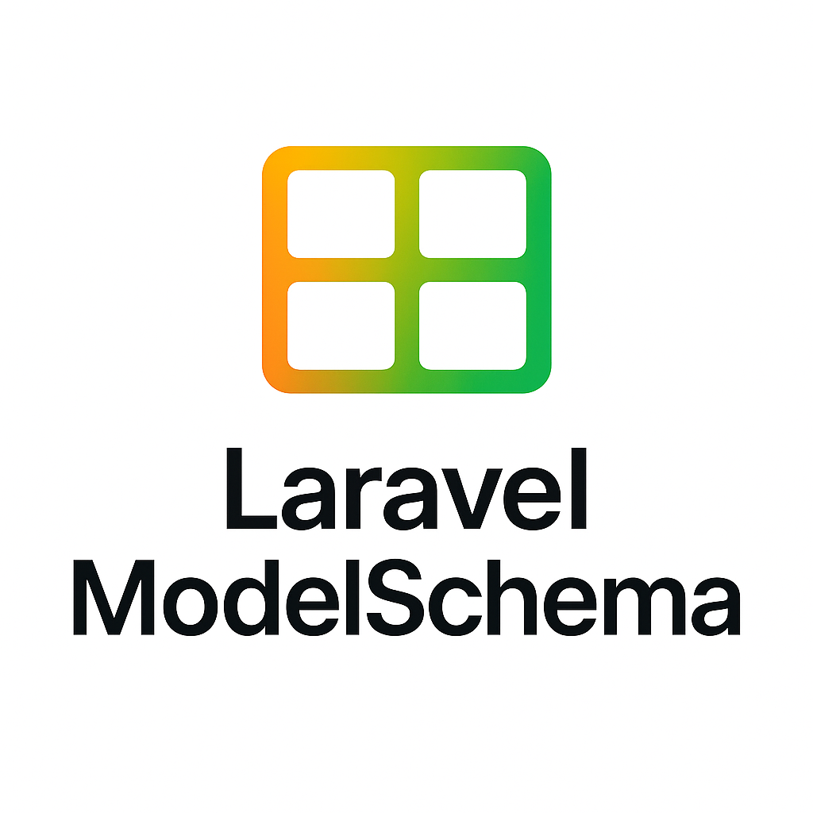

# Laravel ModelSchema



A foundational Laravel package for schema-driven development. Parse YAML schemas, generate insertable fragments for models, migrations, requests, resources, factories, and seeders. Built to power Laravel TurboMaker, Arc, and other schema-based packages.

[](https://packagist.org/packages/grazulex/laravel-modelschema)
[](https://packagist.org/packages/grazulex/laravel-modelschema)
[](https://github.com/Grazulex/laravel-modelschema/blob/main/LICENSE.md)
[](https://php.net/)
[](https://laravel.com/)
[](https://github.com/Grazulex/laravel-modelschema/actions)
[](https://github.com/laravel/pint)

## Overview

Laravel ModelSchema provides **schema parsing, validation, and fragment generation** for Laravel applications. Instead of generating complete files, it produces **insertable JSON/YAML fragments** that parent applications can integrate into their own generation workflows.

**🎯 Core Purpose**: Enable schema-driven development with clean separation between core schema logic and application-specific generation.

### 🚀 Key Features

- **🔍 Schema Parsing & Validation** - Parse YAML schemas with core/extension separation
- **🧩 Fragment Generation** - Generate insertable JSON/YAML fragments for Laravel artifacts  
- **🏗️ Clean Architecture** - Separate core schema responsibilities from app-specific generation
- **🔄 Multi-Generator Support** - Models, Migrations, Requests, Resources, Factories, Seeders
- **� Integration API** - Complete workflow for external packages (TurboMaker, Arc, etc.)
- **✨ Extensible Design** - Custom field types, generators, and validation rules

## � Installation

```bash
composer require grazulex/laravel-modelschema
```

## 🏗️ Architecture

### Core Services

- **`SchemaService`** - Main API for parsing, validation, and core/extension separation
- **`GenerationService`** - Coordinates all generators to produce insertable fragments
- **6 Specialized Generators** - Model, Migration, Request, Resource, Factory, Seeder

### Schema Structure

The package uses a **"core" structure** to clearly separate core schema data from application extensions:

```yaml
core:
  model: User
  table: users
  fields:
    name:
      type: string
      nullable: false
    email:
      type: string
      unique: true
  relations:
    posts:
      type: hasMany
      model: App\Models\Post
  options:
    timestamps: true
    soft_deletes: false

# Extensions added by parent applications
turbomaker:
  views: ['index', 'create', 'edit']
  routes: ['api', 'web']

arc:
  permissions: ['view', 'create', 'edit', 'delete']
```

## 🚀 Quick Start

### 1. Basic Schema Parsing

```php
use Grazulex\LaravelModelschema\Services\SchemaService;

$schemaService = new SchemaService();

// Parse and separate core from extensions
$result = $schemaService->parseAndSeparateSchema($yamlContent);
// Returns: ['core' => [...], 'extensions' => [...]]

// Validate only the core schema
$errors = $schemaService->validateCoreSchema($yamlContent);

// Extract structured data for generation
$data = $schemaService->extractCoreContentForGeneration($yamlContent);
```

### 2. Complete Integration Workflow

```php
// 1. Generate complete YAML from stub + app data
$completeYaml = $schemaService->generateCompleteYamlFromStub(
    'user.schema.stub',
    ['MODEL_NAME' => 'User', 'TABLE_NAME' => 'users'],
    $appExtensionData
);

// 2. Validate the complete YAML (focuses on core section)
$errors = $schemaService->validateFromCompleteAppYaml($completeYaml);

// 3. Extract all generation data as insertable fragments
$generationData = $schemaService->getGenerationDataFromCompleteYaml($completeYaml);

// 4. Use fragments in your application
$modelFragment = json_decode($generationData['generation_data']['model']['json'], true);
$migrationFragment = json_decode($generationData['generation_data']['migration']['json'], true);
```

### 3. Fragment-Based Generation

```php
use Grazulex\LaravelModelschema\Services\GenerationService;

$generationService = new GenerationService();

// Generate all fragments for a schema
$fragments = $generationService->generateAll($schema);

// Result structure:
// [
//   'model' => ['json' => '{"model": {...}}', 'yaml' => 'model: {...}'],
//   'migration' => ['json' => '{"migration": {...}}', 'yaml' => 'migration: {...}'],
//   'requests' => ['json' => '{"requests": {...}}', 'yaml' => 'requests: {...}'],
//   'resources' => ['json' => '{"resources": {...}}', 'yaml' => 'resources: {...}'],
//   'factory' => ['json' => '{"factory": {...}}', 'yaml' => 'factory: {...}'],
//   'seeder' => ['json' => '{"seeder": {...}}', 'yaml' => 'seeder: {...}']
// ]
```

## 🔧 API Reference

### SchemaService

| Method | Description | Returns |
|--------|-------------|---------|
| `parseAndSeparateSchema()` | Parse YAML and separate core/extensions | `['core' => array, 'extensions' => array]` |
| `validateCoreSchema()` | Validate only core schema section | `array` (errors) |
| `extractCoreContentForGeneration()` | Extract structured core data | `array` |
| `generateCompleteYamlFromStub()` | Generate complete YAML from stub | `string` |
| `getGenerationDataFromCompleteYaml()` | Extract all generation fragments | `array` |

### GenerationService

| Method | Description | Returns |
|--------|-------------|---------|
| `generateAll()` | Generate all fragments for schema | `array` |
| `generateSingle()` | Generate single generator fragment | `array` |
| `getAvailableGenerators()` | List available generators | `array` |

## 📁 Example Schema Files

### Basic User Schema
```yaml
core:
  model: User
  table: users
  fields:
    name:
      type: string
      nullable: false
      rules: ['required', 'string', 'max:255']
    email:
      type: string
      unique: true
      rules: ['required', 'email', 'unique:users']
    email_verified_at:
      type: timestamp
      nullable: true
    password:
      type: string
      rules: ['required', 'string', 'min:8']
  options:
    timestamps: true
    soft_deletes: false
```

### Blog Post Schema with Relations
```yaml
core:
  model: Post
  table: posts
  fields:
    title:
      type: string
      rules: ['required', 'string', 'max:255']
    slug:
      type: string
      unique: true
      rules: ['required', 'string', 'unique:posts']
    content:
      type: text
      rules: ['required']
    published_at:
      type: timestamp
      nullable: true
    user_id:
      type: foreignId
      rules: ['required', 'exists:users,id']
  relations:
    user:
      type: belongsTo
      model: App\Models\User
    comments:
      type: hasMany
      model: App\Models\Comment
    tags:
      type: belongsToMany
      model: App\Models\Tag
      pivot_table: post_tags
  options:
    timestamps: true
    soft_deletes: true
```

## � Integration with Parent Applications

This package is designed to be consumed by larger Laravel packages like **TurboMaker** and **Arc**. Here's the typical integration pattern:

### Parent Application Workflow

```php
// 1. Parent app generates complete YAML
$yaml = $schemaService->generateCompleteYamlFromStub('user.schema.stub', [
    'MODEL_NAME' => 'User',
    'TABLE_NAME' => 'users'
], $parentAppData);

// 2. Parent app validates the schema
$errors = $schemaService->validateFromCompleteAppYaml($yaml);
if (!empty($errors)) {
    throw new ValidationException($errors);
}

// 3. Parent app extracts generation fragments
$data = $schemaService->getGenerationDataFromCompleteYaml($yaml);

// 4. Parent app integrates fragments into its own files
$parentAppGenerator->generateModelFile($data['generation_data']['model']['json']);
$parentAppGenerator->generateMigrationFile($data['generation_data']['migration']['json']);
// ... etc for requests, resources, factory, seeder
```

### Fragment Structure

Each generator produces insertable fragments with this structure:

```json
{
  "model": {
    "class_name": "User",
    "table": "users", 
    "fields": [...],
    "relations": [...],
    "casts": {...},
    "options": {...}
  }
}
```

The parent application receives these fragments and inserts them into its own generation templates.

## 🧪 Testing

```bash
# Run all tests
composer test

# Run with coverage
composer test-coverage

# Run specific test file
./vendor/bin/pest tests/Unit/SchemaServiceTest.php
```

## 🔧 Requirements

- **PHP**: ^8.3
- **Laravel**: ^12.19 (optional, used in service provider)
- **Symfony YAML**: ^7.3 (for YAML parsing)

## 📚 Documentation

- **📖 [Complete Documentation](https://github.com/Grazulex/laravel-modelschema/wiki)** - Full API reference and guides
- **🚀 [Getting Started](https://github.com/Grazulex/laravel-modelschema/wiki/Getting-Started)** - Installation and basic usage
- **🏗️ [Architecture Guide](https://github.com/Grazulex/laravel-modelschema/wiki/Architecture)** - Understanding the package structure
- **🧩 [Integration Guide](https://github.com/Grazulex/laravel-modelschema/wiki/Integration)** - How to integrate with parent applications

## 🤝 Contributing

We welcome contributions! Please see our Contributing Guide for details.

## 🔒 Security

Please review our Security Policy for reporting vulnerabilities.

## 📄 License

Laravel ModelSchema is open-sourced software licensed under the MIT license.

---

Made with ❤️ by Jean-Marc Strauven (https://github.com/Grazulex)